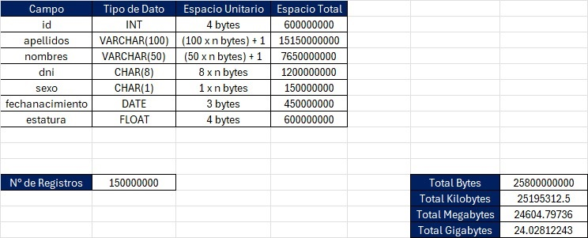

# Tipos de Datos en SQL con MySQL | Qué tipos de datos usar en una base de datos SQL | Curso SQL ✅

En este video aprenderás todo lo que necesitas saber sobre los tipos de datos en SQL usando MySQL. ¿Sabías que elegir el tipo de dato adecuado es crucial para el rendimiento y la eficiencia de tu base de datos? Aquí te explico las diferencias entre INT, FLOAT, VARCHAR, CHAR, DECIMAL y mucho más. Con ejemplos claros, te mostraré cómo cada tipo de dato puede marcar la diferencia en el diseño de tus tablas y consultas.

¿Quieres optimizar tus bases de datos? ¿Te preguntas cuándo usar CHAR en lugar de VARCHAR o DECIMAL en vez de FLOAT? ¡Este es el video para ti! Aprende por qué y cómo seleccionar los mejores tipos de datos para mejorar la velocidad y precisión de tus aplicaciones.

👉 Conceptos claves que aprenderás:

-   Tipos de datos en SQL
-   MySQL tipos de datos
-   Elegir tipo de dato adecuado en MySQL
-   SQL tutorial para principiantes
-   Optimización de bases de datos en SQL
-   VARCHAR vs CHAR
-   DECIMAL vs FLOAT vs DOUBLE

 

## 1. Tipos Numéricos

-   TINYINT: 1 byte
-   SMALLINT: 2 bytes
-   MEDIUMINT: 3 bytes
-   INT (INTEGER): 4 bytes
-   BIGINT: 8 bytes
-   FLOAT:
    -   4 bytes (precisión simple)
    -   8 bytes (precisión doble)
-   DOUBLE: 8 bytes
-   DECIMAL(M, D): (M + 2) bytes donde M es el número total de dígitos y D es el número de decimales.
    -   Cada grupo de 9 dígitos requiere 4 bytes.

## 2. Tipos de Fecha y Hora

-   DATE: 3 bytes
-   DATETIME: 5 bytes (sin fracción de segundos) o hasta 8 bytes (con fracción de segundos)
-   TIMESTAMP: 4 bytes
-   TIME: 3 bytes
-   YEAR: 1 byte

## 3. Tipos de Texto

-   CHAR(M): El tamaño depende del número de caracteres M multiplicado por el número de bytes por carácter en la codificación usada.
    -   UTF-8: Puede ser de 1 a 4 bytes por carácter.
    -   Ejemplo: Si usas CHAR(10) con UTF-8, el tamaño máximo es de 40 bytes (10 caracteres \* 4 bytes).
-   VARCHAR(M): El tamaño depende del número de caracteres M, más 1 o 2 bytes para almacenar la longitud.
    -   Si el número de caracteres es menor o igual a 255, se almacenan 1 byte adicional para la longitud.
    -   Si el número de caracteres es mayor a 255, se requieren 2 bytes para la longitud.
    -   UTF-8: Cada carácter puede ocupar hasta 4 bytes.
    -   Ejemplo: VARCHAR(255) con UTF-8 puede ocupar hasta 1021 bytes (255 \* 4 + 1).

## 4. Tipos de Texto Largo

-   TINYTEXT: Hasta 255 bytes
-   TEXT: Hasta 65,535 bytes (64 KB)
-   MEDIUMTEXT: Hasta 16,777,215 bytes (16 MB)
-   LONGTEXT: Hasta 4,294,967,295 bytes (4 GB)

## 5. Tipos Binarios

-   BINARY(M): Similar a CHAR(M) pero almacena datos binarios. Tamaño fijo de M bytes.
-   VARBINARY(M): Similar a VARCHAR(M) pero almacena datos binarios. Ocupa M bytes más 1 o 2 bytes para la longitud.

## 6. Tipos de Datos de Enums y Sets

-   ENUM: Ocupa 1 o 2 bytes dependiendo de la cantidad de valores posibles.
-   SET: Depende del número de elementos en el conjunto. Cada bit representa un valor, por lo que el tamaño en bytes varía.

Ejemplo con CHAR y VARCHAR

-   CHAR(10) en UTF-8: Puede ocupar hasta 40 bytes.
-   VARCHAR(255) en UTF-8: Puede ocupar hasta 1020 bytes, más 1 o 2 bytes para la longitud.

 

# 🌍 Por si deseas contactarme 👨‍💻 :

